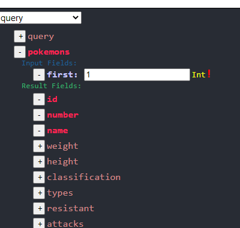
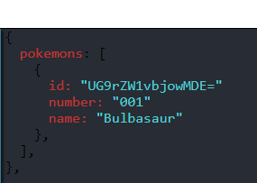

Graphite is an alternative tool for developing and testing GraphQL APIs. 
For more information about graphql you can view some additional resources:

* [GraphQL website](https://graphql.org/)
* [GraphQL specs](https://spec.graphql.org/June2018/)

#### Deployed Demo Project
[You Can View This Demo To See What The Project Is About](https://rezga12.github.io/Graphite/)

#### How To use

There are two ways to connect to some graphql server:

* you can connect specify URL parameter in the left upper side of the screen:

* or you can choose one of the dummy API-s on the left right side of the screen:

after connecting to the server you can view their schema by clicking the green button on the right border of the screen.
In this panel you can choose some fields to appear or disappear by ckecking or unchecking checkboxes:

for more information about schema introspection, graphql types and objects please read introspection part of their specification.
[4.5 Schema Introspection](https://spec.graphql.org/June2018/#sec-Schema-Introspection)

On The Left Panel You'll See a drop down menu where you can choose what kind of queries can be performed to this api. Normally
for GraphQL there are three types of queries:
* Query
* Mutation
* Subscription

currently `Graphite` Doesn't support Subscriptions. you can feel free to open a PR or help us expand this feature.
Also If you wish to learn more about GraphQL operation types you can start [Here](https://graphql.org/learn/queries/).

ToPerform An Operation You Have to choose two types of Queries in left panel of the screen:
* requested type fields
* input type fields

above picture illustrates how simple query operation can be performed with Graphite. In this example we chose id, numberand name 
as requested fields and specified first to be 1. in case of this api it means that we need to ake first 1 entry of the
database. so the return value will be one pokemon and it's specified fields: 

That's it for the first example of Graphite. You can explore this tool further by sending and 
receiveing various other types of queries.
