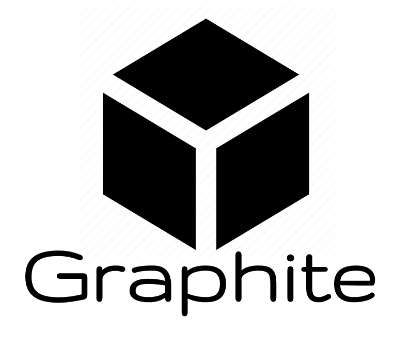
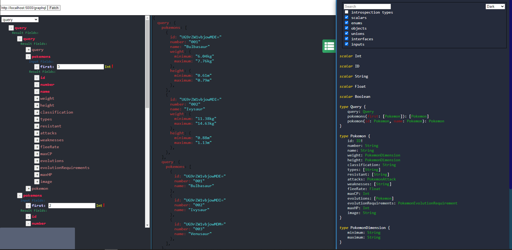
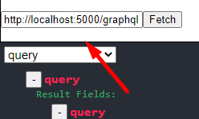
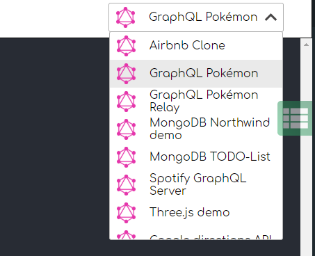
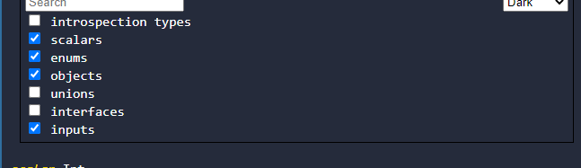

Graphite is an alternative tool for developing and testing GraphQL APIs. 
For more information about graphql you can view some additional resources:

* [GraphQL website](https://graphql.org/)
* [GraphQL specs](https://spec.graphql.org/June2018/)

#### Deployed Demo Project
[You Can View This Demo To See What The Project Is About](https://rezga12.github.io/Graphite/)

#### How To use

There are two ways to connect to some graphql server:

* you can connect specify URL parameter in the left upper side of the screen:

* or you can choose one of the dummy API-s on the left right side of the screen:

after connecting to the server you can view their schema by clicking the green button on the right border of the screen.
In this panel you can choose some fields to appear or disappear by ckecking or unchecking checkboxes:

for more information about schema introspection, graphql types and objects please read introspection part of their specification.
[4.5 Schema Introspection](https://spec.graphql.org/June2018/#sec-Schema-Introspection)
